## TODO

## Idea

### 胡思乱想1

结合CLIP和Prompt学习；knowledge prompt image；

* [KnowPrompt & OntoPrompt](https://mp.weixin.qq.com/s/HPQ8AjoVN6UsHZdag1-xZw)
* [PromptPapers](https://github.com/thunlp/PromptPapers)
* [多模态中的prompt](https://mp.weixin.qq.com/s/hegK-Aut8s6KfYIe-glgag)
* [多模态最新方向：各种问题，细分方向](https://zhuanlan.zhihu.com/p/389287751)
* [后prompt时代](https://mp.weixin.qq.com/s/EOJGIXSo7bj7oi0nqbbMlw)

知识提示的问题：
1. 如何高效地植入外部知识，构建提示模板和标签映射？
2. 并不是所有外部知识都有帮助，如何解决知识噪音和异构性问题？

---

* `[cls]` image `[sep]` the **itemcate** **proporty** is `?`?
* `[cls]` image `[sep]` the type of **itemcate_level1** is `?`?
* `[cls]` image `[sep]` the color of t-shirt in picture is `?(red, black, unkonwn)`

商品理解、cpv这种内容，可以用来构建prompt句式；句式就直接问非id类型（品牌、型号）的属性（颜色、款式）

一问品类、二问属性

property prompt in ecommerce multimodal pretrain

visual question answering 建模 prompt：给定一个图像，根据标题或cpv中的属性 来构造问题；（prompt or vqa)
1. 问什么问题
  * 什么问题是可以根据图片回答的？（哪些属性、答不出来怎么处理；品类可以问，死马当活马医）
  * 怎么去构造比较干净的问题（prompt）
  * 问：
    * 是什么
    * 卖什么
    * 有什么
    * XX属性是什么
    用另一模态辅助
      以mask的方式回答即可？或者利用 encode-decode架构；将MAE的decode替换为bert，decode内容替换为答案。
2. 图片问题
  * 淘宝商品的主图 和 真实的拍照实物图 有些区别；淘宝商品图通常是做了加工的（比如配上文字、排版等），会包含很多辅助信息
  * 相当多（相当多）的图片上包含文本信息（顺丰包邮、品牌名，巴拉巴拉）
  * 主体识别（加大主体mask概率：留石），忽略背景、排版、文字的影响，单流模型 or 其他
  * 


---

阶段1: 三组对比， Query-Title, Query-Image, Title-Image
阶段2:
* prompt 双流 交互；答案直接mask就ok
* prompt 单流，图片用VIT，问题用BERT，结构是encode-decode，MAE的decode替换为bert，且用来回答问题


* [阿里小蜜VQA](https://ata.alibaba-inc.com/articles/173749?spm=ata.23639746.0.0.3a843565f75afS)


### 胡思乱想2

现在多模态训练的任务都是初级的任务；比如 image-text match, image-text contrastive; 并包含单模态的经典学习任务，比如 mlm, mim等；

就学习而言，判别任务更直接，也相对容易；为了让模型获取更高high level的理解能力；通过生成的方式，让模态之间互相提示。

text2image (VAE, GAN) 

image caption([image captioning](https://proceedings.neurips.cc/paper/2019/file/680390c55bbd9ce416d1d69a9ab4760d-Paper.pdf))

主要问题
1. 两个生成任务应该都非常hard
2. 淘宝商品中的主图和标题，并非所见即所说的关系，存在一定比例辅助或不相关的信息；


### 胡思乱想3


图文联合训练，加入推理 Video-Language Inference

对于一个商品。image 根据 标题、cpv内容推理图片内 关系、实体； 标题、cpv根据 image 内容 推理image中物体的关系（VCR） 最后得到联合表示（对齐模型）

主要问题：
1. 图片中可能不存在关系 或 关系太难界定
2. 图片中描述与展示性的内容居多，关系内容很少 


### 胡思乱想4

（魔改模型，模态融合，todo:3.26）

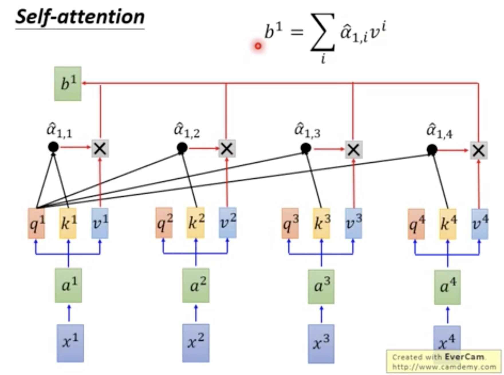

再执行transformers层时，单流模型（比如 fashionbert）图文两种模态会无差别的进行self-attention；
即图中的patch 和 文中的 word；他们通过相同的线性层映射到 q, k, v; 然后细分多份head(q, k, v)；
此时的q, k, v将进行self-attention操作，给定元素的q会和序列中其他的所有k进行相关性计算（点积），
这样会导致 dot(q(w1),k(w2)) & dot(q(w1),k(i1)) & dot(q(i2),k(i1)) 并存，
即 w1 和 w2, i1 都要进行相似度计算；并以此衡量 w1 和 w2、i1 的相似度；但w 和 i 本是两种不同的模态，这种计算会使得两种模态混合（不是融合，没有区分特点）（同理, i1 和 w1, i2，被进行相似度计算）
（区分图文的唯一信息来源是 底层输入的token_type_ids， **w和i的表示不完全兼容，直接相似度计算，得到的信息(权重)不够精确**）

*新方法，w和w之间使用正常self-attention交互，w和i之间通过映射关系h变换后，进行正常self-attention：w+h->w', w'与交互；同理i-h=i' i'与w进行交互*
（tranE的思想直观上远比transD合适)

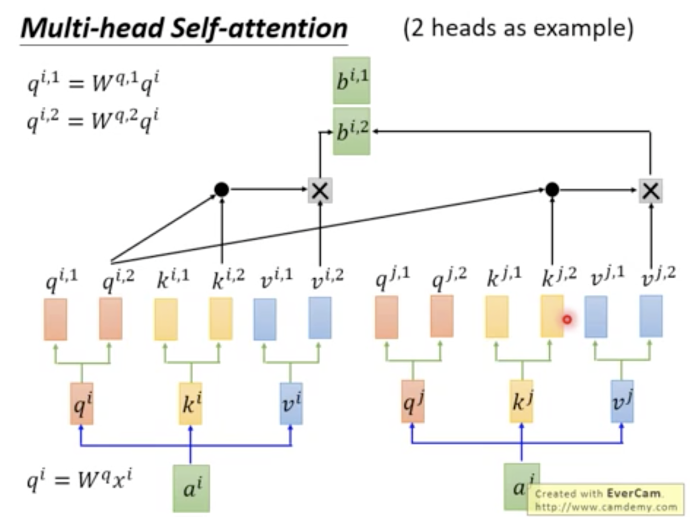

（新坑啊，模型模态融合；参考下blip: Bootstrapping Language-Image Pre-training for Unified Vision-Language Understanding and Generation）

---


## Survey

* [多模态预训练综述](https://mp.weixin.qq.com/s/X-G7ARBWG49rKDQSHJ1ICQ)
* [awesome-vision-language-pretraining-papers](https://github.com/yuewang-cuhk/awesome-vision-language-pretraining-papers)
* [vit-pytorch](https://github.com/lucidrains/vit-pytorch)
* [从LXMERT到VLMO：多模态预训练模型的演变史](https://mp.weixin.qq.com/s?__biz=MzIwMTc4ODE0Mw==&mid=2247547810&idx=2&sn=4e3c845e049340921c5568bae1def6ce)
* [万字综述！从21篇最新论文看多模态预训练模型研究进展](https://mp.weixin.qq.com/s?__biz=MzIwMTc4ODE0Mw==&mid=2247546641&idx=1&sn=0cdc826b91e3317674222f748873d730&chksm=96eae891a19d61879deafa00790e1d38cc7b8860b1ac3da071f341b10965ac4f4bba2d46e692&token=1937743143&lang=zh_CN&scene=21#wechat_redirect)
* [从多篇2021年顶会论文看多模态预训练模型最新研究进展](https://mp.weixin.qq.com/s?__biz=MzIwMTc4ODE0Mw==&mid=2247543295&idx=1&sn=795bd6c44a425912ba3519ed63c35d95&chksm=96eaf67fa19d7f696c75f4ce1ededc7a7c54c4403bbb873b249f32ad8d8e9768dde908d0f13c&token=1937743143&lang=zh_CN&scene=21#wechat_redirect)
* [🌟awesome-multimodal-ml](https://github.com/pliang279/awesome-multimodal-ml)


### Trends in Integration of Vision and Language Research: A Survey of Tasks, Datasets, and Methods

* JAIR 2021
* [paper](https://arxiv.org/abs/1907.09358?utm_source=feedburner&utm_medium=feed&utm_campaign=Feed%253A+arxiv%252FQSXk+%2528ExcitingAds%2521+cs+updates+on+arXiv.org%2529)
* 135pages
* 综述有点老


## Summary

| No.      | model       | Description    |
| :---  |    :----   |          :---: |
|    1   | ViT         | ...    |
|    2   | InterBERT        | ...       |
|    3   | fashionBERT      | ...       |
|    4   | Kaleido-BERT     | ...       |


(标题中序号仅表示添加顺序)

### 1. AN IMAGE IS WORTH 16X16 WORDS: TRANSFORMERS FOR IMAGE RECOGNITION AT SCALE

* 🌟
* ICLR 2021
* [paper](https://arxiv.org/abs/2010.11929)
* [code](https://github.com/google-research/vision_transformer), [vit-pytorch](https://github.com/lucidrains/vit-pytorch)
* [weixin](https://mp.weixin.qq.com/s/KyL74PwoXDWuuPLiziYPRA)

---

把图片分割成一块一块的patch，完全利用和BERT一样的结构和训练方式，将预训练从文本扩展到图片中；（属于挖新坑的工作）

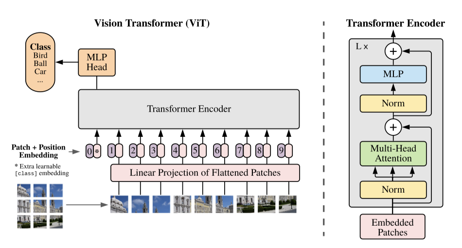


### 2. InterBERT: Vision-and-Language Interaction for Multi-modal Pretraining

* KDD 2020
* [paper](https://arxiv.org/abs/2003.13198)


---

多模态预训练、M6中的多模态（**MultiModality**-toMultiModality Multitask Mega-transformer）

* 主要目标，图文表示，the improvement in multi-modal representation learning
* 模型结构
  * 图emb
  * 文emb
  * 图文transformer
  * 图encoder
  * 文encoder
  
* 训练方法
  * MSM, masked segment modeling, text中的span mask
  * MRM, masked region modeling, 图像中的region(目标检测结果,IoUs) expand mask
  * ITM, image-text matching, hard negatives: 文本描述tf-idf小于0.5的top30
  

> 阿里巴巴、电商；可模仿写作

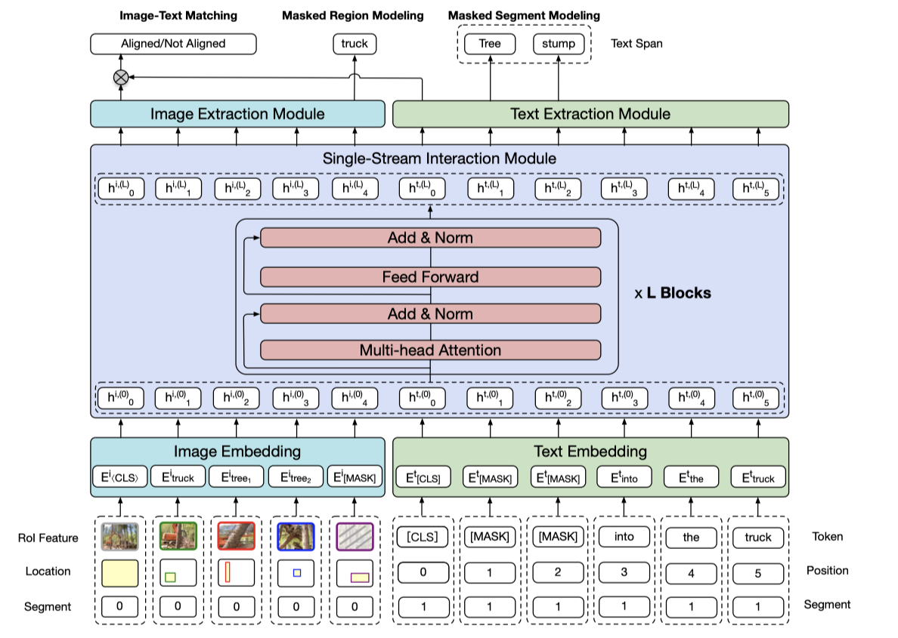

### 3. FashionBERT: Text and Image Matching with Adaptive Loss for Cross-modal Retrieval

* SIGIR 20 Industry Track
* [paper](https://arxiv.org/abs/2005.09801)
* [link](https://developer.aliyun.com/article/763357)

---

* 提出一种图文匹配模型，以求对电商图像特征更好的提取和表达
* 模型结构：双流模型
* 训练方法：
  * masked language modeling
  * masked patch modeling
  * text and image alignment
  * 为多任务学习，本文还设计了一个adaptive loss自适应每个任务权重
  
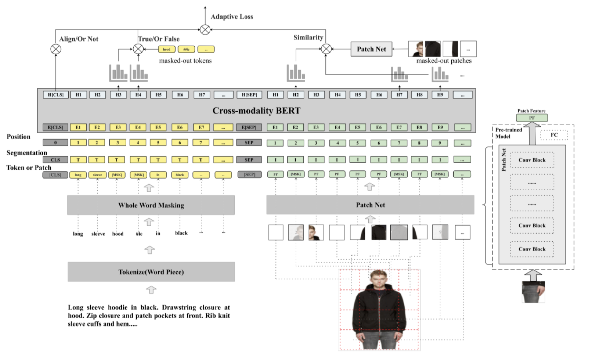


### 4. Kaleido-BERT: Vision-Language Pre-training on Fashion Domain

* CVPR2021
* [paper](https://arxiv.org/abs/2103.16110)
* [ata link](https://ata.alibaba-inc.com/articles/210439?spm=ata.23639746.0.0.673a5da3nIPN0w)

---

* 多尺度图像特征提取（KPG）
* 图文预对齐（AAG、AGM）
* 图像自监督（task: AKPM, TIM, AMLM）

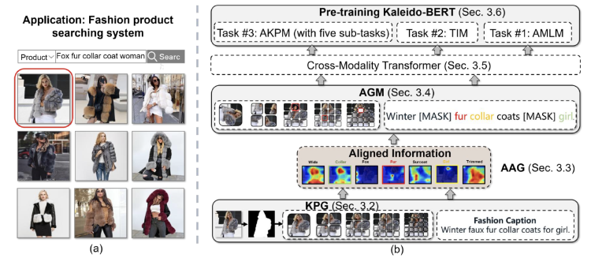

> 论文中的实验表格做的不错，相当于模型综述了

### 5. Pixel-BERT: Aligning Image Pixels with Text by Deep Multi-Modal Transformers

* arXiv2004
* [paper](https://arxiv.org/abs/2004.00849)

---

主要目标在于通过图文匹配任务获取更好的图文联合表示，方法过于简单

1. BERT编码文字，CNN编码图片，合并接上transformer层
2. 训练任务：图文匹配任务+语言模型的MLM

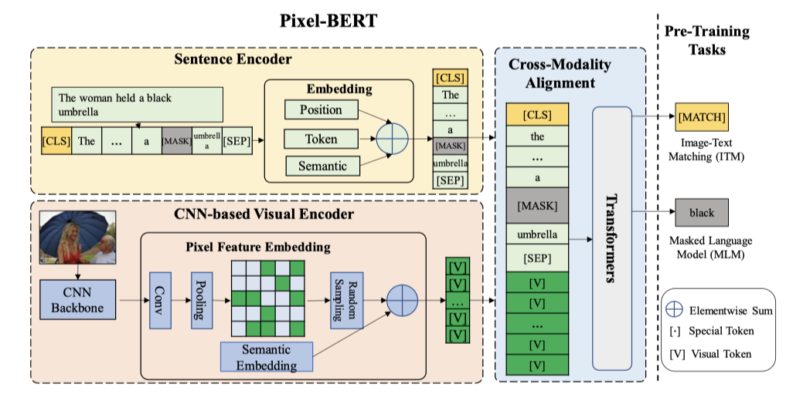


### 6. ViLBERT: Pretraining Task-Agnostic Visiolinguistic Representations for Vision-and-Language Tasks

* arXiv 1908
* [paper](https://arxiv.org/abs/1908.02265)

---

* 模型结构：双流模型
  * 文本直接通过BERT编码
  * 图像通过预训练的目标检测网络(ResNet-101+Faster R-CNN)抽取图像bounding boxes(根据置信度，数量控制在10-36)

* 训练方法
  * mask文（和bert一样）
  * mask图（Masked image regions have their image features zeroed out 90% of the time and are unaltered 10%）
  * 图文匹配任务linear(cat(, <CLS>), 2)

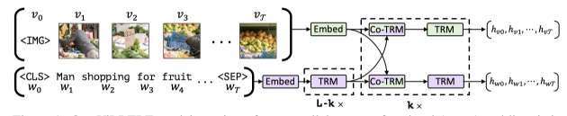

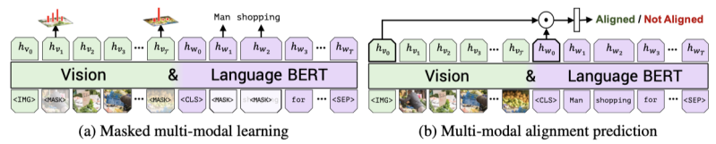


### 7. UNITER: UNiversal Image-TExt Representation Learning

* ECCV 2020
* [paper](https://arxiv.org/abs/1909.11740)
* [code](https://github.com/ChenRocks/UNITER)

---

* 主要目标学习图文的联合表示
* 模型结构
  * 图emb: R-CNN+location
  * 文emb: bert
  
* 训练方法
  * Masked Language Modeling (MLM)
  * Masked Region Modeling (MRM, with three variants)
  * Image-Text Matching (ITM)
  * Word-Region Alignment (WRA)
  * 从4个图文数据集训练(COCO, Visual Genome, Conceptual Captions, and SBU Captions)

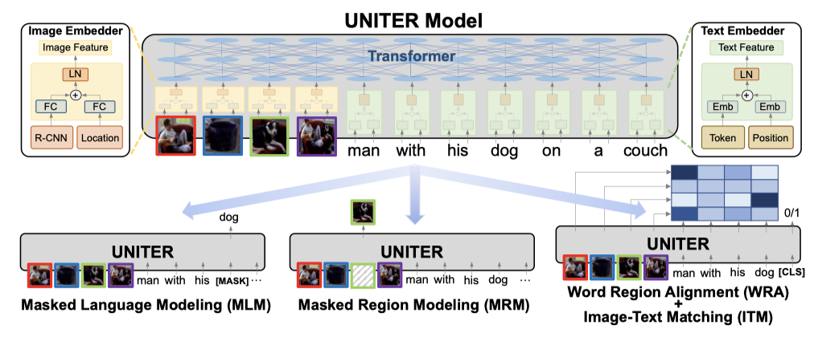


### 8. LXMERT: Learning Cross-Modality Encoder Representations from Transformers

* EMNLP 2019
* [paper](https://arxiv.org/abs/1908.07490)
* [code](https://github.com/airsplay/lxmert)

---

* 主要目标，most importantly, the alignment and relationships between these two modalities.
* 模型结构
  * 图特征，图encode
  * 文特征，文encode
  * 图文cross encoder
  
* 训练方法
  * masked language modeling 
  * masked object prediction (feature regression and label classification) 
  * cross-modality matching 
  * image question answering

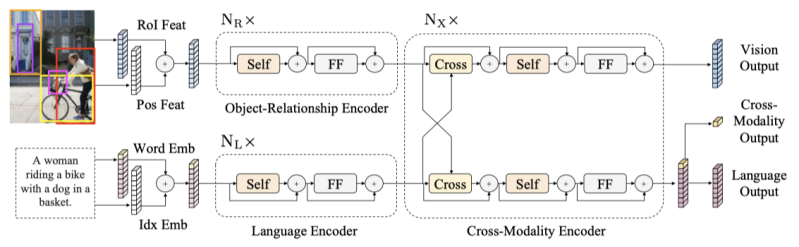

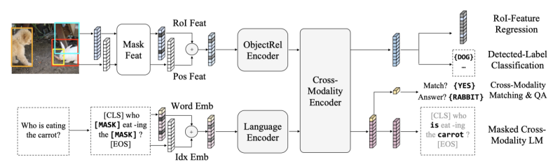


### 9. ViLT: Vision-and-Language Transformer Without Convolution or Region Supervision

* ICML 2021
* [paper](https://arxiv.org/abs/2102.03334)
* [code](https://github.com/dandelin/vilt)

---

* 主要目标，将文本、图片联合训练转到BERT的统一格式了；模型简单，效率高；
* 模型结构
  * 图emb
  * 文emb
  * 图文cross encoder
  
* 训练方法
  * ITM(image text matching)，包含WPA(word patch alignment操作)，这里效仿了UNITER中都WRA，使用的都是optimal transports方法，计算两个分布之间的最小转换代价[zhihu link](https://zhuanlan.zhihu.com/p/82424946)
  * MLM(whole word masking, 这都不算啥创新点，凑字数)
  * IA(image augment) during fine-tuning

>（思想到没啥新鲜感、多模态的论文都没啥新鲜感，连积木都懒得拼了）

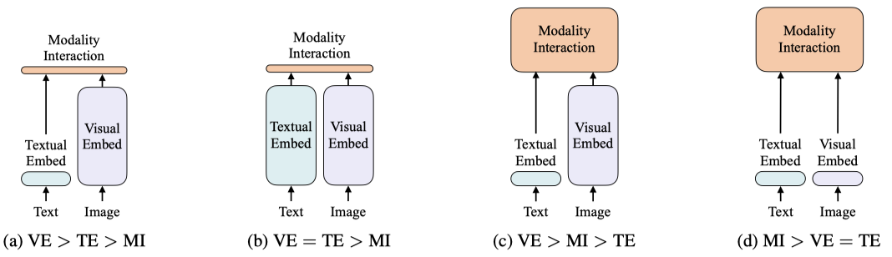

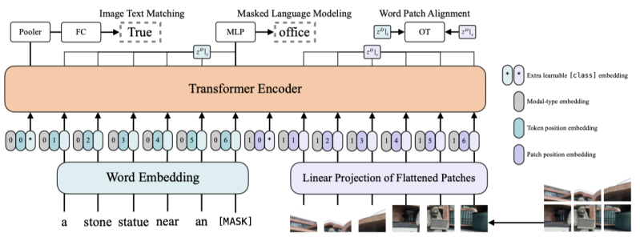

### 10. UNIMO: Towards Unified-Modal Understanding and Generation via Cross-Modal Contrastive Learning

* ACL 2021
* [paper](https://arxiv.org/abs/2012.15409)
* [code](https://github.com/PaddlePaddle/Research/tree/master/NLP/UNIMO)

---

**动机**

当前的预训练任务或在单模态，或在多模态；这些模型的应用只能局限于 单模态或特定的多模态（image-text pairs）；
本文设计一种 unified-modal，利用大量图像文本（但非image-text pair）进行跨模态学习，将文本和图像编码到同一语义空间中；
使得模型本身不仅能够单独处理图、文模态，也能处理图文的联合模态。

---

* 主要目标，把图文学习到同一语义空间中
* 训练方法
  * 联合表示的不同模态表示对比学习
  * 图单模态和联合表示内的文模态对比学习
  * 文单模态和联合表示内的图模态对比学习
  
> 之前考虑过这种做法，或很类似

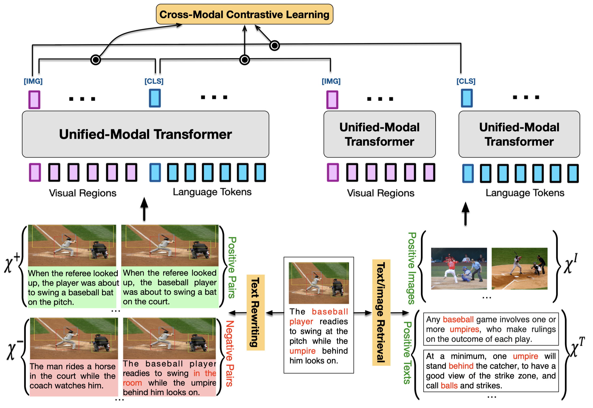


### 11. Oscar:


### 12. CLIP

* 🌟
* ICML 2021
* [paper](https://arxiv.org/abs/2103.00020)
* [code](https://github.com/openai/CLIP)
* [openai blog](https://openai.com/blog/clip/)
* [bilibili video](https://www.bilibili.com/video/BV1SL4y1s7LQ)
* [How to Train Really Large Models on Many GPUs?](https://lilianweng.github.io/lil-log/2021/09/24/train-large-neural-networks.html)


---

**动机**

当前STOA的CV系统通常都是在学习/预测 确定类别的目标（e.g. 利用ImageNet），这限制了CV系统的泛化和应用；直接与自然语言一起学习图像表示，
能够获得更丰富的监督信号，从而可能学到更好的图像表示。本文收集4亿(image, text) pairs作为数据集，将自然语言作为监督信号，利用对比学习+图文匹配任务进行预训练。

CLIP迁移学习效果非常好，预训练好的模型能够在任意视觉分类任务中取得好的效果，并且是zero-shot的

---

* 预训练目标：比较标准的用对比学习做图文匹配
* zero-shot分类过程：
  * prompt将类别构成文本，生成表示
  * 和图片做相似度计算，并通过softmax得到分类

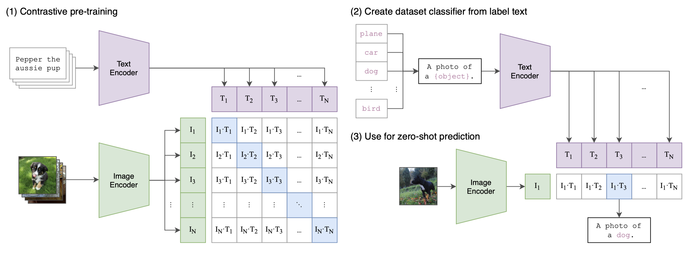

```python 
# image_encoder   - ResNet or Vision Transformer 
# text_encoder    - CBOW or Text Transformer 
# I[n, h, w, c]   - minibatch of aligned images 
# T[n, l]         - minibatch of aligned texts 
# W_i[d_i, d_e]   - learned proj of image to embed 
# W_t[d_t, d_e]   - learned proj of text to embed 
# t               - learned temperature parameter

# extract feature representations of each modality 
I_f = image_encoder(I) #[n, d_i] 
T_f = text_encoder(T) #[n, d_t]

# joint multimodal embedding [n, d_e] 
I_e = l2_normalize(np.dot(I_f, W_i), axis=1) 
T_e = l2_normalize(np.dot(T_f, W_t), axis=1)

# scaled pairwise cosine similarities [n, n] 
logits = np.dot(I_e, T_e.T) * np.exp(t)

# symmetric loss function 
labels = np.arange(n) 
loss_i = cross_entropy_loss(logits, labels, axis=0) 
loss_t = cross_entropy_loss(logits, labels, axis=1) 
loss = (loss_i + loss_t)/2
```

### 13. Seeing Out of tHe bOx: 

* CVPR 2021 oral
* [paper](https://arxiv.org/abs/2104.03135)
* [code](https://github.com/researchmm/soho)


### 14. VinVL

* CVPR 2021
* [paper](https://arxiv.org/abs/2101.00529)
* [code](https://github.com/pzzhang/VinVL)


### 15. Scaling Up Visual and Vision-Language Representation Learning With Noisy Text Supervision

* ICML 2021
* [paper](https://arxiv.org/abs/2102.05918)

---

ALIGN

### 16. E2E-VLP: End-to-End Vision-Language Pre-training Enhanced by Visual Learning

* ACL 2021
* [paper](https://arxiv.org/abs/2106.01804)


### 17. MURAL: Multimodal, Multitask Retrieval Across Languages

* EMNLP 2021
* [paper](https://arxiv.org/abs/2109.05125)

相关paper *Scaling Up Visual and Vision-Language Representation Learning With Noisy Text Supervision*

---


**动机**

image-caption pairs和translation pairs对于跨语言深度学习至关重要

---

* 训练方法
  * image-text 图文表示对比学习
  * text-text  文文表示（不同语种）对比学习
  
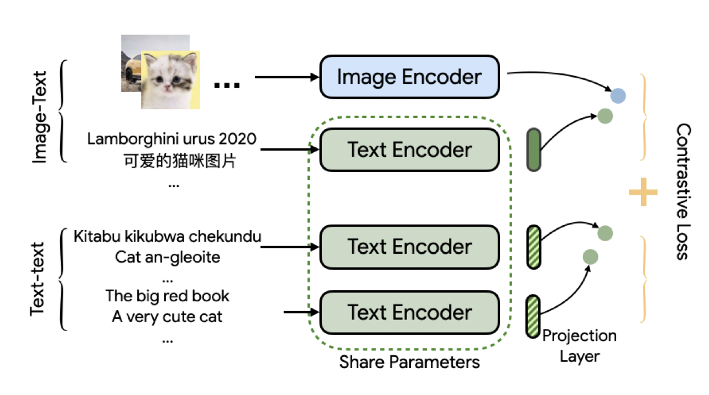


### 18. Large-Scale Adversarial Training for Vision-and-Language Representation Learning

* NeurIPS 2020
* [paper](https://arxiv.org/abs/2006.06195)
* [code](https://github.com/zhegan27/LXMERT-AdvTrain)

相关paper，uniter、LXMERT


### 19. SimVLM: Simple Visual Language Model Pretraining with Weak Supervision


* [paper](https://arxiv.org/abs/2108.10904)
* 


### 20. MLIM: Vision-and-Language Model Pre-training with Masked Language and Image Modeling

* [paper]()


### 21. Unified Multimodal Pre-training and Prompt-based Tuning for Vision-Language Understanding and Generation

* [paper](https://arxiv.org/abs/2112.05587)

---

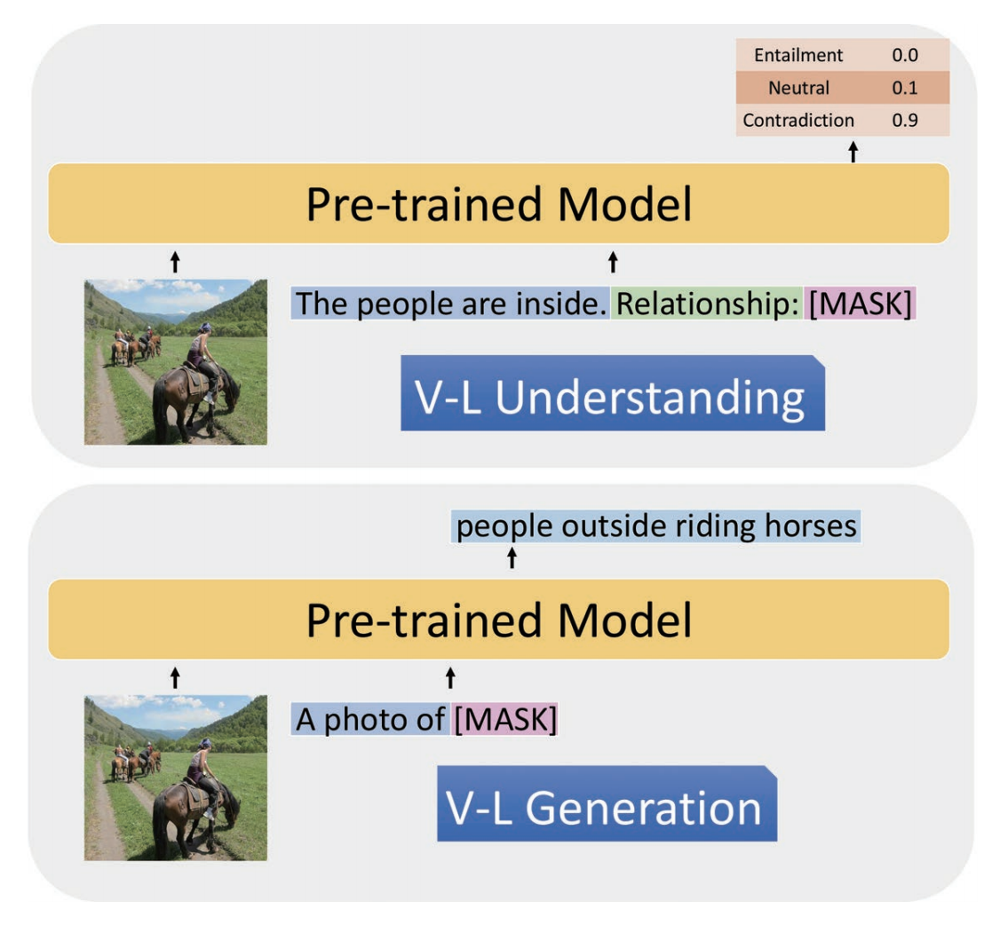


### 22. CLIP-Event: Connecting Text and Images with Event Structures

* [paper](https://arxiv.org/abs/2201.05078)
* [code](https://github.com/limanling/clip-event)

---

**动机**

以往的V+L方法，通过对齐image, text学习到多模态表示。并主要关注图像目标与文本中实体之间的对齐，没有关注events、参与者之间的关系（精细理解）

---

* 训练方法
  * 对比学习+prompt
  * 

---

## MISC & Other

### Does Vision-and-Language Pretraining Improve Lexical Grounding?

* EMNLP 2021
* [paper](https://arxiv.org/abs/2109.10246)


### BLIP: Bootstrapping Language-Image Pre-training for Unified Vision-Language Understanding and Generation

* [paper](https://arxiv.org/abs/2201.12086)
* [code](https://github.com/salesforce/BLIP)

---
**动机** ？没有去解决特定的问题；但是换了一种方式，将多模态的模型融合了（原来要么是单塔、要么是双塔）
本文是图像encoder接上文本encoder，并在文本encoder中集成了cross-attention，融合两种模态内容；（模型层面的融合）


---

* 训练方法
  * 模型级联的方式
    * part1 先使用image encoder对图片编码
    * part2 再用text encoder对文本进行编码
    * part1 和 part2 之间 使用ITC(image-text contrastive loss)训练
    * part1 和 part2 进行融合，多了个 cross-attention 模块，用来将图文模态表示合并；
      * 使用图文匹配任务进行训练 (image-text matching loss)
      * 使用语言模型(language modeling loss)任务来适配文本生成任务ß


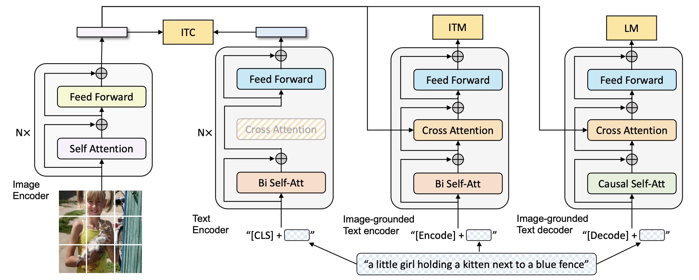

---


